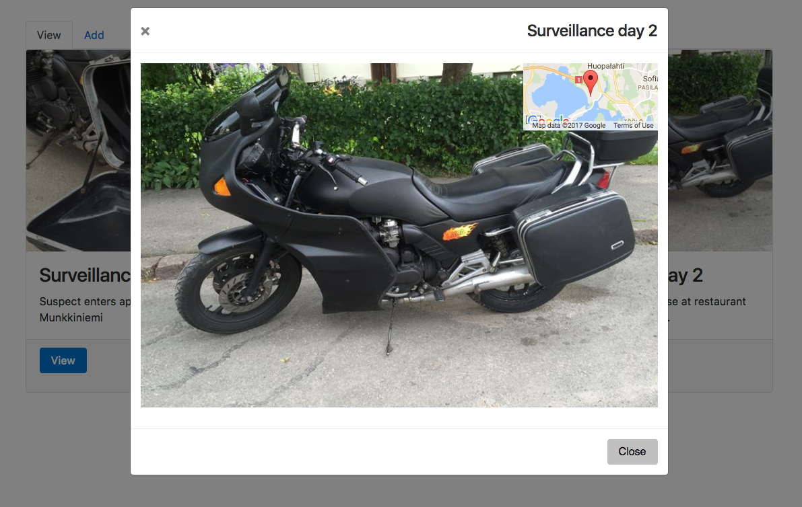

# Week 1 assignment

Make an Express.js app that has following features.
  * Form to upload data and image (see image below)
  * Set the coordinates by clicking Leaflet (or other) map or get the coordinates from EXIF data from JPG (take a photo with your phone).
    * [EXIF](https://github.com/gomfunkel/node-exif)
    * Leaflet example:
    ```html
    <!-- html -->
    <div id="map" style="width: 500px; height: 400px;"></div>
    ```
    ```javascript
    // JavaScript
    const map = L.map('map').setView([51.505, -0.09], 13);
    
    L.tileLayer('https://{s}.tile.openstreetmap.org/{z}/{x}/{y}.png', {
        attribution: '&copy; <a href="https://www.openstreetmap.org/copyright">OpenStreetMap</a> contributors'
    }).addTo(map);
    
    map.on('click', (evt) => {
        alert("Lat, Lon : " + evt.latlng.lat + ", " + evt.latlng.lng)
    });
    
    map.on('locationfound', (evt) => {
        map.setView(ev.latlng, 13);
    });
    
    ```
  * Upload image
    * send as [FormData](https://developer.mozilla.org/en-US/docs/Web/API/FormData)
    * receive with [_multer_](https://github.com/expressjs/multer)
  * Convert image to small and medium versions
    * [_sharp_](https://github.com/lovell/sharp)
  * 1st version: Save the data from the form and image urls to data.json
     * multer and/or [_body-parser_](https://github.com/expressjs/body-parser)
     * [Node Filesystem](https://nodejs.org/dist/latest-v6.x/docs/api/fs.html) or [node-jsonfile](https://github.com/jprichardson/node-jsonfile)
     * data.json example:
     ```json
        [
          {
            "id": "12",
            "time": "2017-03-02 22:55",
            "category": "House cats",
            "title": "Title 1",
            "details": "Lorem ipsum dolor sit amet, consectetur adipiscing elit. Duis sodales enim eget leo condimentum vulputate. Sed lacinia consectetur fermentum. Vestibulum lobortis purus id nisi mattis posuere. Praesent sagittis justo quis nibh ullamcorper, eget elementum lorem consectetur. Pellentesque eu consequat justo, eu sodales eros.",
            "coordinates": {
              "lat": "60.2196781",
              "lng": "24.8079786"
            },
            "thumbnail": "http://placekitten.com/320/300",
            "image": "http://placekitten.com/768/720",
            "original": "http://placekitten.com/2048/1920"
          },
          {
            "id": "15",
            "time": "2017-03-01 19:23",
            "category": "House cats",
            "title": "Title 2",
            "details": "Donec dignissim tincidunt nisl, non scelerisque massa pharetra ut. Sed vel velit ante. Aenean quis viverra magna. Praesent eget cursus urna. Ut rhoncus interdum dolor non tincidunt. Sed vehicula consequat facilisis. Pellentesque pulvinar sem nisl, ac vestibulum erat rhoncus id. Vestibulum tincidunt sapien eu ipsum tincidunt pulvinar. ",
            "coordinates": { "lat": "60.3196781", "lng": "24.9079786" },
            "thumbnail": "http://placekitten.com/321/300",
            "image": "http://placekitten.com/770/720",
            "original": "http://placekitten.com/2041/1920"
          },
          {
            "id": "34",
            "time": "2017-12-04 09:45",
            "category": "Feral cats",
            "title": "Title 3",
            "details": "Phasellus imperdiet nunc tincidunt molestie vestibulum. Donec dictum suscipit nibh. Sed vel velit ante. Aenean quis viverra magna. Praesent eget cursus urna. Ut rhoncus interdum dolor non tincidunt. Sed vehicula consequat facilisis. Pellentesque pulvinar sem nisl, ac vestibulum erat rhoncus id. ",
            "coordinates": { "lat": "60.3196781", "lng": "24.9079786" },
            "thumbnail": "http://placekitten.com/319/300",
            "image": "http://placekitten.com/769/720",
            "original": "http://placekitten.com/2039/1920"
          }
        ]
     ```
  * 2nd version: Save the data from the form and image urls to database
  * Display the updated data on the frontend
    * Make a frontend of your choice: browser or mobile; HTML + CSS or hybrid or native iOS or Android

>Example layout:

>Example layout:

>Example form:

